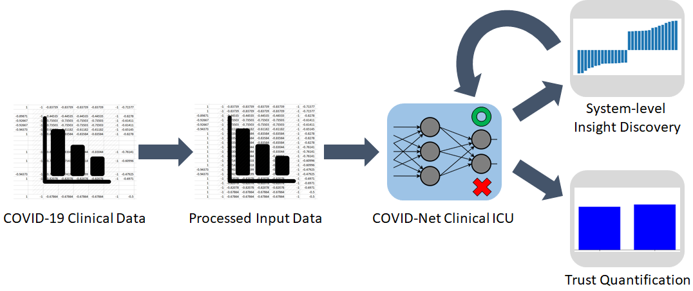

# COVID-Net Clinical ICU
The COVID-19 pandemic continues to have a devastating global impact, and has placed a tremendous burden on struggling healthcare systems around the world. Given the limited resources, accurate patient triaging and care planning is critical in the fight against COVID-19, and one crucial task within care planning is determining if a patient should be admitted to a hospital’s intensive care unit (ICU). Motivated by the need for transparent and trustworthy ICU admission clinical decision support, we introduce COVID-Net Clinical ICU, a neural network for ICU admission prediction based on patient clinical data. Driven by a transparent, trust-centric methodology, the proposed COVID-Net Clinical ICU was built using a clinical dataset from Hospital Sirio-Libanes comprising of 1,925 COVID-19 patients, and is able to predict when a COVID-19 positive patient would require ICU admission with an accuracy of 96.9\% to facilitate better care planning for hospitals amidst the on-going pandemic. We conducted system-level insight discovery using a quantitative explainability strategy to study the decision-making impact of different clinical features and gain actionable insights for enhancing predictive performance. We further leveraged a suite of trust quantification metrics to gain deeper insights into the trustworthiness of COVID-Net Clinical ICU. By digging deeper into when and why clinical predictive models makes certain decisions, we can uncover key factors in decision making for critical clinical decision support tasks such as ICU admission prediction and identify the situations under which clinical predictive models can be trusted for greater accountability. For more information, please visit 
[Introducing COVID-Net Clinical ICU](https://medium.com/darwinai/introducing-covid-net-clinical-icu-an-explainable-and-trustworthy-ai-for-predicting-covid-19-icu-57c36e039b81).

COVID-Net Clinical ICU is part of the COVID-Net initiative. Found out more at 
 [www.covid-net.ml](http://www.covid-net.ml)

	
	 
	<em>Overview of transparent, trust-centric design methodology for COVID-Net Clinical ICU.</em>

Note: The COVID-Net Clinical ICU model provided here is intended to be used as a reference model that can be built upon and enhanced as new data becomes available. It is currently at a research stage and not yet intended as a production-ready model (not meant for direct clinical usage), and we are working continuously to improve it as new data becomes available.

# Dataset #

Dataset has 1925 records from 385 patients. For each patients we have 5 records for 5 different time windows:

* From 0 to 2 hours of the admission 
* From 2 to 4 hours of the admission
* From 4 to 6 hours of the admission
* From 6 to 12 hours of the admission 
* Above 12 hours from admission

The features can be divided into four different categories:

* Patient demographic information(3)
* Patient previous grouped diseases(9)
* Blood results (36)
* Vital signs(6)

Some notes:

* For each factor in the blood results mean, median, max, min, diff have been provided which leads to 36 * 5 = 180 features.
* For each factor vital sign mean, median, max, min, diff and relative diff have been provided which leads to 6 * 6 = 36 features.
* Total number of features is 228.

### Missing data ###
There are some missing values in the dataset.
The dataset provider mentioned that it is better to fill missing values with respect to previous or next entry of the same patient. When patient has stable situation they do not measure all the features so neighbor time window can be used.

So we used previous time window of each patient to fill the patient's missing values

### The earlier, the better! ###
The dataset provider mentioned that it is better to create the predictive model using the first time window instead of using all time windows.

We removed all the records with ICU=1 since we want to predict addmission before it has happend.

all the records of patinet with ICU=0 are considered as admited label if the patient has at least one record with ICU=1
all the records of patinet with ICU=0 are considered as not admited label if the patient has no record with ICU=1

### How to run
In order to run this demo, python3.6 should be installed. Use the following command to run.
`python run.py`